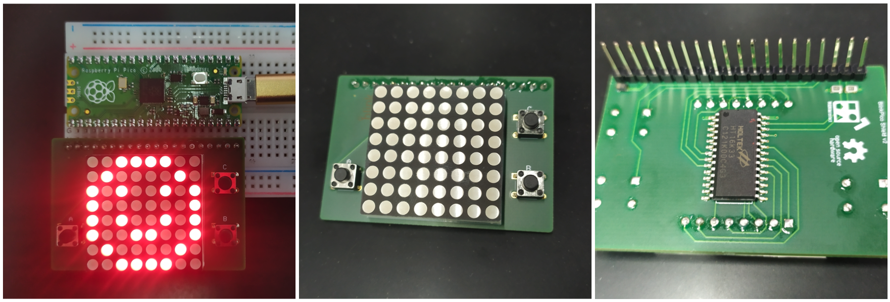

# BlinkPico

A shield with three buttons and a 8x8 LED Matrix display.
Hardware design files and software library are open source.



Software library with examples can be found [here](library/README.md).


```
Designed by MAKinteract - 2021
```
